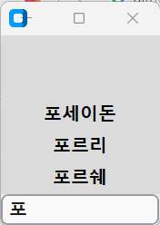
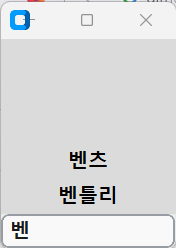
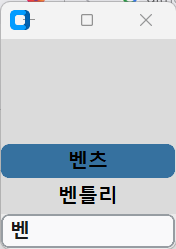

# custiomtkinter 한국어 검색
jamo 모듈 이용한 customtkinter 검색 프레임

SEARCH_FRAME(선택 리스트 위치, 검색창 위치, 리스트/투플 형태의 명단, 선택 리스트 개수)

## 이용 모듈
### 외부
- jamo -> h2j
- customtkinter
- pynput

### 빌트인
- functools
## 작동 예시

